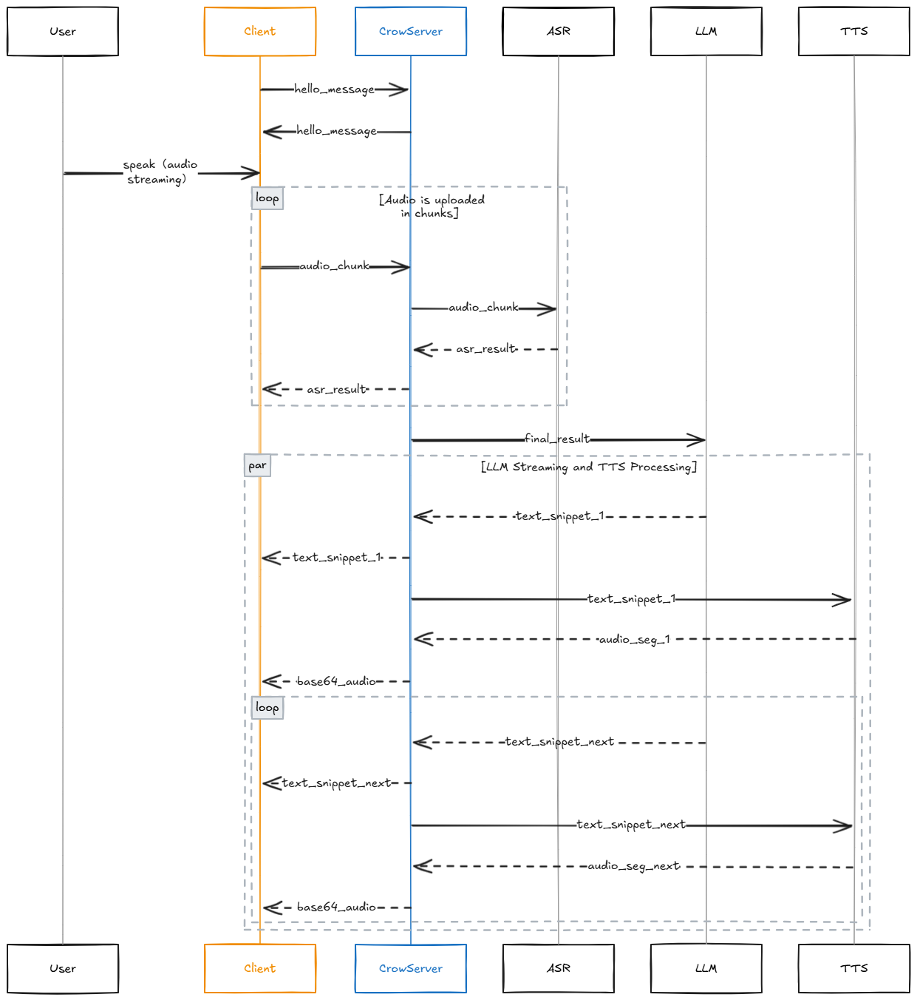

<p align="center">
  
</p>

[](https://www.python.org/downloads/) [](https://opensource.org/licenses/MIT)  

English | [中文](README.md) 

## 🐦‍⬛ Crow - Intelligent Voice Assistant Service

**As smart as a crow, connecting the world with voice**

Crow is an extensible open-source voice assistant service (AI Agent) supporting voice dialogue, large language model function calling, and custom MCP (Model Context Protocol) service orchestration. It provides developers with implementation ideas for voice-driven AI Agents.

### ✨ Core Features

- **Voice Conversation**: Supports real-time speech recognition and synthesis, enabling natural interaction with AI.

- **Function Calling for Large Language Models**: Support for LLM function calling with custom functions.

- **Custom MCP Service Scheduling**: Supports custom MCP service scheduling and custom services.

### 🤔 Why the Name "Crow"

Crow (乌鸦, wūyā) represents one of nature’s rare tool-using birds with advanced intelligence, symbolizing:

- **Speak**: Real-time voice recognition and synthesis enable natural dialogues like a crow’s communication.

- **Clever**: Integration of large models for complex decision-making mirrors the crow’s ingenuity.

- **Collaborate**: Tool coordination through function calling and MCP orchestration embodies collaborative intelligence.

## 👀 Demo


## 🚀 Quick Start

This project is developed based on Go 1.24.2. Before using, ensure you have the corresponding Go environment set up.

1. Clone the repository

```bash
git clone https://github.com/Shinveam/crow.git
cd crow
```

2. Initialize the project

```bash
go mod tidy
```

3. Project Configuration
    - Follow the [Configuration Instructions](config/README_en.md)👈.

> The project provides two ways to start. For a full voice interaction experience, use method one.

### 1️⃣ Method One: Start the WebSocket Service

```bash
go run cmd/ws-server/main.go
```

> This project provides client examples in both HTML and Python (located in `example/`). Running the corresponding client allows for a complete experience of the project's functionality.

### 2️⃣ Method Two: Start the Command-Line Interface

```bash
go run cmd/agent-cli/main.go
```

## 🔌 Client Integration

### 🌐 Integration Guide

#### 1. Integration Method

- **Scheme**: websocket

- **Port**: 28080 (can be modified in the configuration file)

- **Path**: /crow/v1

#### 2. Integration Flow

1. After the client connects to the server, it must send a "hello" message of text type (opcode = 1) (see "hello request" below). After sending, the server will send a "hello" acknowledgment, indicating that the task has started successfully and subsequent interactions can begin;

2. The client can interact by text or voice. For text, send a "chat" message of text type (see "chat request").

3. For voice interaction, upload the audio to be recognized. Set the message type to binary (opcode = 2), and the message content is the audio chunk data.

4. The server sends messages as **text type** with JSON-serialized data (see parameter descriptions below).

#### 3. Parameter Descriptions

<details>
<summary><strong>1. hello Request (Click to Expand)</strong></summary>

> **Description**: Set task parameters and start the task  
> **Message Type**: Text (opcode = 1)  
> **Message Format**: JSON

|       Parameter        |  Type  |                  Description                   | Required | Default  |
|:----------------------:|:------:|:----------------------------------------------:|:--------:|:--------:|
|          type          | string |                  Fixed: hello                  |   Yes    |    -     |
|       enable_asr       |  bool  |                  Enable ASR?                   |    No    |  false   |
|       enable_tts       |  bool  |                  Enable TTS?                   |    No    |  false   |
|       asr_params       | object | ASR settings (takes effect if enable_asr=true) |    No    |    -     |
|   asr_params.format    | string |        Format of the audio to recognize        |    No    |   pcm    |
| asr_params.sample_rate |  int   |             Audio sample rate (Hz)             |    No    |  16000   |
|  asr_params.channels   |  int   | Number of audio channels (1: mono, 2: stereo)  |    No    |    1     |
|   asr_params.vad_eos   |  int   |           VAD endpoint timeout (ms)            |    No    |   800    |
| asr_params.enable_punc |  bool  |              Enable punctuation?               |    No    |  false   |
|  asr_params.language   | string |             Language, e.g., zh, en             |    No    |    zh    |
|   asr_params.accent    | string |          Accent: mandarin, cantonese           |    No    | mandarin |
|       tts_params       | object | TTS settings (takes effect if enable_tts=true) |    No    |    -     |
|   tts_params.speaker   | string |                   Speaker ID                   |    No    |    -     |
|   tts_params.format    | string |                TTS audio format                |    No    |   mp3    |
|    tts_params.speed    | float  |                Speed: [0.5-2.0]                |    No    |   1.0    |
|   tts_params.volume    |  int   |                Volume: [0-100]                 |    No    |    50    |
|    tts_params.pitch    | float  |                Pitch: [0.5-2.0]                |    No    |   1.0    |
| tts_params.sample_rate |  int   |             Audio sample rate (Hz)             |    No    |  16000   |
|  tts_params.language   | string |             Language, e.g., zh, en             |    No    |    zh    |

</details>

<details>
<summary><strong>2. hello Response (Click to Expand)</strong></summary>

> **Message Type**: Text (opcode = 1)  
> **Message Format**: JSON

|       Parameter        |  Type  |                  Description                   | Present |
|:----------------------:|:------:|:----------------------------------------------:|:-------:|
|          type          | string |                  Fixed: hello                  |   Yes   |
|       asr_params       | object | ASR settings (takes effect if enable_asr=true) |   No    |
|   asr_params.format    | string |        Format of the audio to recognize        |   No    |
| asr_params.sample_rate |  int   |             Audio sample rate (Hz)             |   No    |
|  asr_params.channels   |  int   | Number of audio channels (1: mono, 2: stereo)  |   No    |
|   asr_params.vad_eos   |  int   |           VAD endpoint timeout (ms)            |   No    |
| asr_params.enable_punc |  bool  |              Enable punctuation?               |   No    |
|  asr_params.language   | string |             Language, e.g., zh, en             |   No    |
|   asr_params.accent    | string |          Accent: mandarin, cantonese           |   No    |
|       tts_params       | object | TTS settings (takes effect if enable_tts=true) |   No    |
|   tts_params.speaker   | string |                   Speaker ID                   |   No    |
|   tts_params.format    | string |                TTS audio format                |   No    |
|    tts_params.speed    | float  |                Speed: [0.5-2.0]                |   No    |
|   tts_params.volume    |  int   |                Volume: [0-100]                 |   No    |
|    tts_params.pitch    | float  |                Pitch: [0.5-2.0]                |   No    |
| tts_params.sample_rate |  int   |             Audio sample rate (Hz)             |   No    |
|  tts_params.language   | string |             Language, e.g., zh, en             |   No    |

</details>

<details>
<summary><strong>3. abort Request (Click to Expand)</strong></summary>

> **Description**: Can be sent during interaction to interrupt the current conversation.  
> **Message Type**: Text (opcode = 1)  
> **Message Format**: JSON

| Parameter |  Type  | Description  | Required | Default |
|:---------:|:------:|:------------:|:--------:|:-------:|
|   type    | string | Fixed: abort |   Yes    |    -    |

</details>

<details>
<summary><strong>4. chat Request (Click to Expand)</strong></summary>

> **Description**: Send text.  
> **Message Type**: Text (opcode = 1)  
> **Message Format**: JSON

| Parameter |  Type  |   Description   | Required | Default |
|:---------:|:------:|:---------------:|:--------:|:-------:|
|   type    | string |   Fixed: chat   |   Yes    |    -    |
| chat_text | string | User query text |   Yes    |    -    |

</details>

<details>
<summary><strong>5. chat Response (Click to Expand)</strong></summary>

> **Description**: Response text. Both text and voice requests will return this type of message for the reply.  
> **Message Type**: Text (opcode = 1)  
> **Message Format**: JSON

| Parameter |  Type  | Description | Present |
|:---------:|:------:|:-----------:|:-------:|
|   type    | string | Fixed: chat |   Yes   |
|   text    | string | Reply text  |   No    |

</details>

<details>
<summary><strong>6. asr Response (Click to Expand)</strong></summary>

> **Description**: ASR response result.  
> **Message Type**: Text (opcode = 1)  
> **Message Format**: JSON

| Parameter |  Type  |                   Description                   | Present |
|:---------:|:------:|:-----------------------------------------------:|:-------:|
|   type    | string |                   Fixed: asr                    |   Yes   |
|  result   | string |               Recognition result                |   No    | 
|   state   |  int   | State: 0-recognizing, 1-sentence end, 2-asr end |   No    |

</details>

<details>
<summary><strong>7. tts Response (Click to Expand)</strong></summary>

> **Description**: TTS response result.  
> **Message Type**: Text (opcode = 1)  
> **Message Format**: JSON

| Parameter |  Type  |              Description              | Present |
|:---------:|:------:|:-------------------------------------:|:-------:|
|   type    | string |              Fixed: tts               |   Yes   |
|   audio   | string | Base64-encoded audio data (in chunks) |   No    | 
|   state   |  int   |   State: 0-synthesizing, 1-finished   |   No    |

</details>

<details>
<summary><strong>8. error Response (Click to Expand)</strong></summary>

> **Description**: Error response.  
> **Message Type**: Text (opcode = 1)  
> **Message Format**: JSON

| Parameter  |  Type  |            Description            | Present |
|:----------:|:------:|:---------------------------------:|:-------:|
|    type    | string |           Fixed: error            |   Yes   |
| error_code |  int   | Error code: 0-OK, non-zero: error |   Yes   |
| error_msg  | string |           Error message           |   No    |

</details>

### ⏱️ Sequence Diagram



## 📝 TODO

- [ ] Client Request Authentication;
- [ ] Admin Interface;
- [ ] Visual Model Support;

## 🙏 Acknowledgments

Thanks to [OpenManus](https://github.com/FoundationAgents/OpenManus) for the inspiration and code reference.

## 🙋 Contribution Guide

Welcome to submit issues for feedback or suggestions, or contribute code via Pull Requests. Let's grow together!

## 🌟 Star History

[//]: # ([![Star History Chart]&#40;https://api.star-history.com/svg?repos=Shinveam/crow&type=Date&#41;]&#40;https://star-history.com/#Shinveam/crow&Date&#41;)
